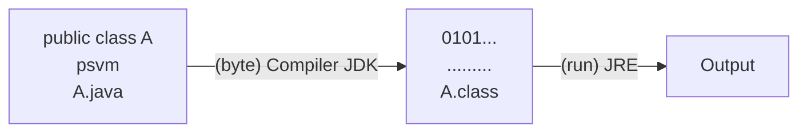

## Constructors in java ##
* Constructors should have some name as that of class.
* To call Constructor we should create object, whenever object is created Constructor will get called.

```java
public class A {
	A() {
		System.out.println(100); //Error
	}
	public static void main(String[] args) {
		A a1 = new A();
		A a2 = new A();
	}
}
```
* Constructors are void and can never return any value.

```java
public class A {
	A() {
		return 200; //Error
	}
	public static void main(String[] args) {
		A a1 = new A();
	}
}
```

### Constructor with parameter ###

```java
public class A {
	A(int x) {
		System.out.println(x);
	}
	public static void main(String[] args) {
		A a1 = new A(500);
	}
}
```

### Constructor overloading ###
* Here we create more than one Constructor in same provided they have different number of arguments or different types of arguments

````java
public class A {
	A(){ //No of args = 0
		System.out.println("A");
	}
	A(int x) { //No of args = 1
		System.out.println(x);
	}
	A(int x, int y) { //No of args = 2
		System.out.println(x);
		System.out.println(y);
	}
	public static void main(String[] args) {
		A a1 = new A();
		A a2 = new A(100);
		A a3 = new A(00,500);
	}
}
````
---

```java
public class A {
	A(int x) { //type = int
		System.out.println(x);
	}
	A(char x) { //type = char
		System.out.println(x);
	}
	A(double x){ //type = double
		System.out.println(x);
	}
	public static void main(String[] args) {
		A a1 = new A(10);
		A a2 = new A('a');
		A a3 = new A(10.3);
	}
}
```


* To convert .java to .class file we require compiler.
* To run .class file we require JRE (Java Runtime Environment)
* When we dont create constructor in .java file then during compilation automatically no args constructor with empty body get's created.

### Note ###
whenever we create object it is mandatory to call constructor.

```java
public class A {
	public static void main(String[] args) {
		A a1 = new A();
	}
}
```

---
```java
public class A {
	A(){   // got added
		
	}
	public static void main(String[] args) {
		A a1 = new A();
	}
}
```
