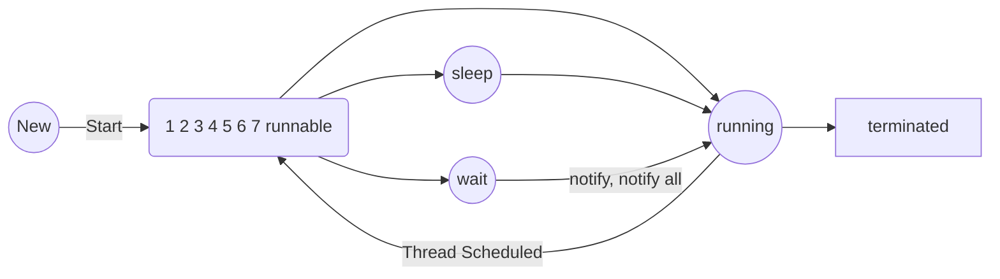

```java
public class A extends Thread {
	public static void main(String[] args) {
		A a1 = new A();
		System.out.println(a1.getState());
		a1.start();

		try {
			Thread.sleep(5000);
		} catch (Exception e) {
			e.printStackTrace();
		}
		System.out.println(a1.getState());
	}

	@Override
	public void run() {
		System.out.println("Test");
	}
}

```