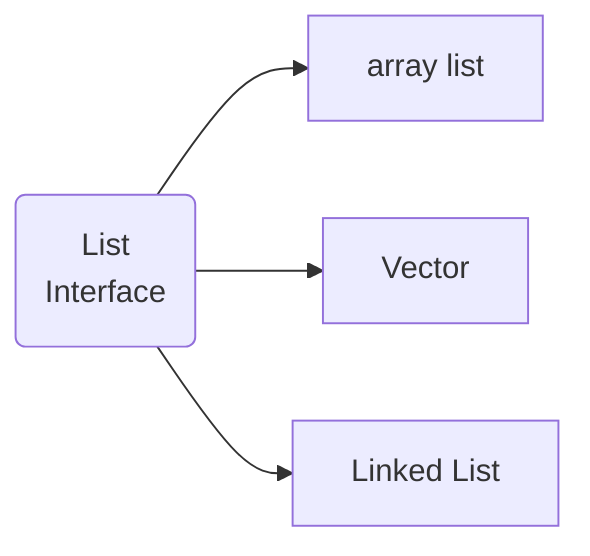

# Collection #

* Collectio stores group of object in it.
* In java collection is a framework whch are readily available logic to deal with different data structurs
## List ##



**Array list**
* Internally it is implemented as dynamic array
* Initial size of array list is 10
* when we exit the initial size automatically array list size increses the size by 1.5 times
* Arrau list maintains by insertsion order 
* It can consists of duplicate elements


**Advantage**
Reading of data would give us best performance
**Disadvantage**
Insertation of data in between of the array list will result a poor performance

```java
package app_java_1;

import java.util.ArrayList;

public class A {
	public static void main(String[] args) {
		ArrayList x = new ArrayList();

		x.add(10); // Boxing
		x.add(20);
		x.add(new Integer(30)); // Boxing
	}
}
```

**In array list we can store hetrogenious data in it.**
```java
package app_java_1;

import java.util.ArrayList;

public class A {
	public static void main(String[] args) {
		ArrayList x = new ArrayList();

		x.add(10); // Boxing
		x.add(20);
		x.add(new Integer(30)); // Boxing
		x.add("Pankaj");
		x.add(true);
		x.add(10.3);
	}
}
```
---
```java
package app_java_1;

import java.util.ArrayList;

public class A {
	

	public static void main(String[] args) {
		ArrayList<Integer> x = new ArrayList<Integer>();

		x.add(10);
		x.add(20);
		x.add(30);
		System.out.println("add method():"+x);
		
		x.add(1, 500);
		System.out.println("add(index, value) method():"+x);
		
		ArrayList<Integer> y = new ArrayList<Integer>();
		y.add(300);
		y.add(500);
		
		x.addAll(2,y);
		System.out.println("addAll(index, collection) method():"+x);
		
		if (x.contains(500)) {
			System.out.println("Yes Present");
		} else {
			System.out.println("No Present");
		}
		
		x.remove(1);
		System.out.println("remove(index) method():"+x);
	}
}
```
