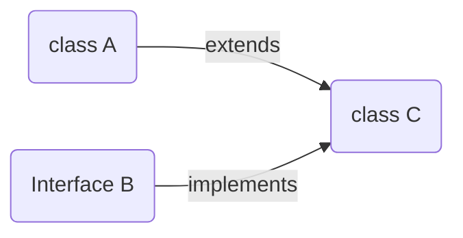

On a particular class we can use both extends & implements but ensure extends is used first and then implements.

```java
package p1;
public class A {

}
```

```java
package p1;
public interface B {

}
```

```java
package p1;
public class C extends A implements B{

}
```

## Final keyword in java ##
* If we make a variable final then its value cannot be changed

```java
public class A {
	public static void main(String[] args) {
		final int x = 10;
		x=20; //Eroor
		System.out.println(x);
	}
}
```

* If we make Static/nonStatic variables final the initialize is mandatory

```java
public class A {
	final int x ; //Error
	final static y ; //Error
	public static void main(String[] args) {
		A a1 = new A();
		System.out.println(a1.x);
	}
}
```

* If we make a method final then overriding is not allowed.


```java
public class A {
	public final void test() {
		
	}
}
```

```java
public class B extends A{
	@Override
	public void test() { //Error

	}

}
```

### Interface continuation ###
* By default all variables in a interface are final & static.

```java
public interface A {
	int empId = 1;
	final static int billingId = 1;
}
```

* We cannot create object od interface but reference variable of interface can be created
```java
public interface A {
}
```

```java
public class B{
	public static void main(String[] args) {
		A a1; //Correct
		A a1 = new A(); //Error
	}
}
```
----

```java
public interface A {
	int empId = 1;
	final static int billingId = 1;
}
```

```java
public class B{
	public static void main(String[] args) {
		System.out.println(A.empId);
		System.out.println(A.billingId);
	}
}
```


