### Mutable ###
Mutable is something where the class object properties keeps on changing

### Immutable ###
Immutable class once its object is created then its state cannot be altered.

Steps to create Immutable class: 
* Create a final class
* Set the values of the properties using onlu constructors
* Make the properties as final
* Do not provide any setters for these properties

```java
final public class A {
	private final int age;
	private final String name;

	public A(int age, String name) {
		this.age = age;
		this.name = name;
	}

	public int getAge() {
		return age;
	}

	public String getName() {
		return name;
	}

	public static void main(String[] args) {
		A a1 = new A(20, "Pankaj");
		System.out.println(a1.getAge());
		System.out.println(a1.getName());
	}
}
```

---
```java
final public class A {
	public static void main(String[] args) {
		String s1 = new String("xyz");
		String s2 = new String("xyz");
		System.out.println(s1==s2);
		System.out.println(s1.equals(s2));
	}
}
```
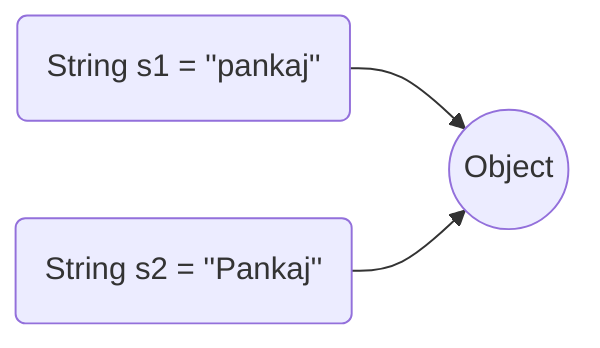

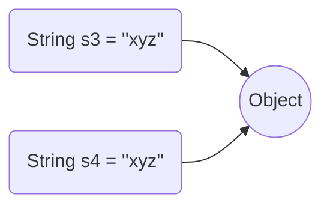
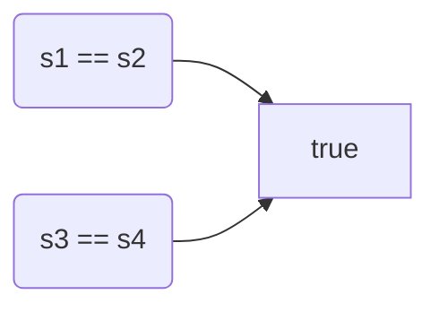

s1.equals(s2) --> true
s3.equals(s4) --> true

---
String s1 = new String ("xyz");

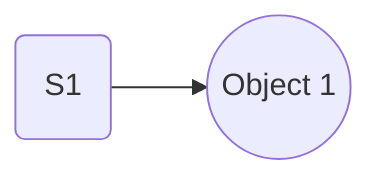

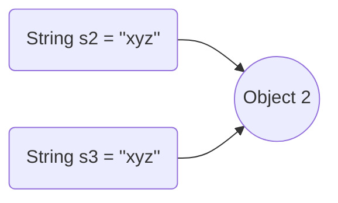

String s4 = new String ("xyz");
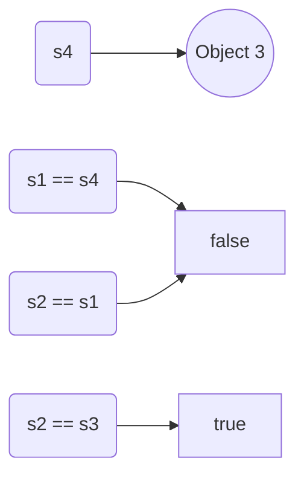
---
A(String s1 = ''xyz'');
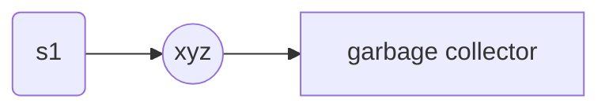
s1 = "abc";

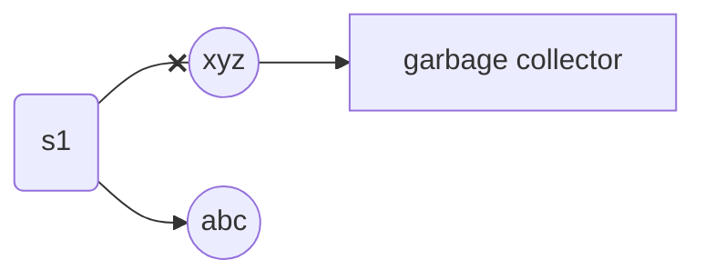
s1 = "xxxx"
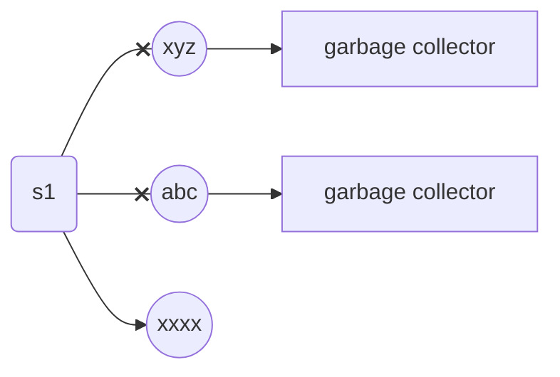
---


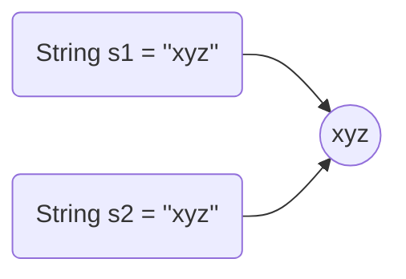

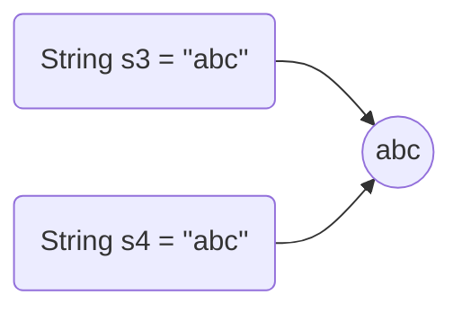