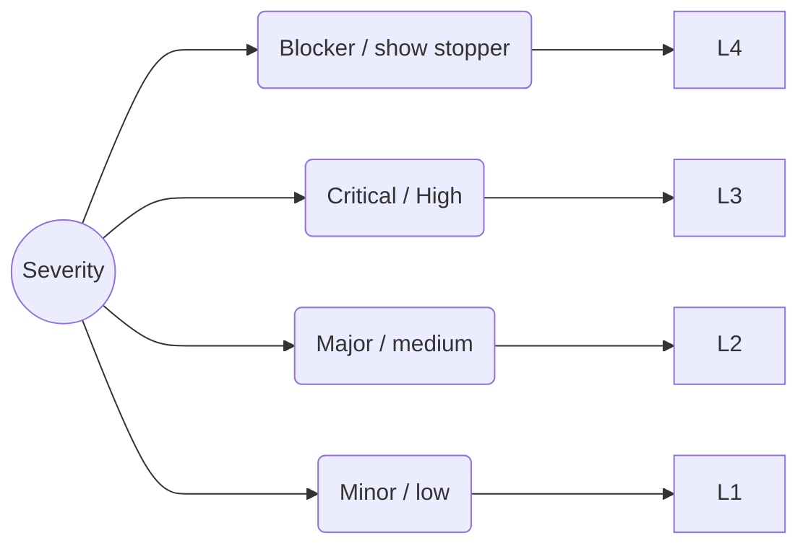
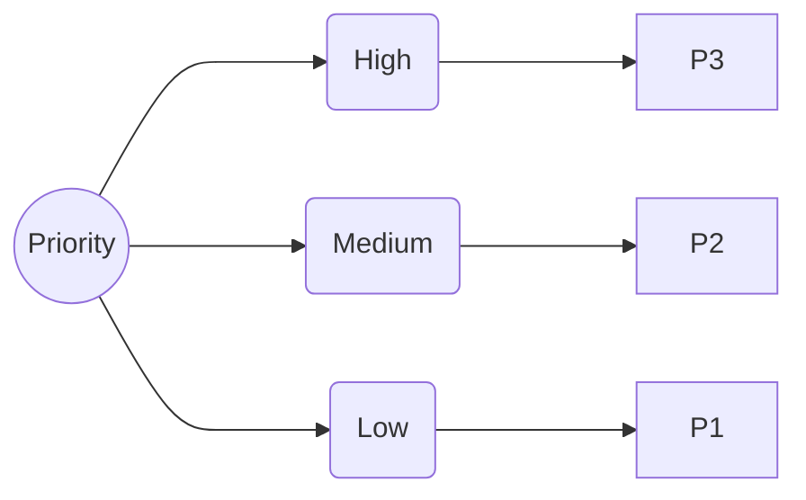

In PSA app go to **Store** / **Manual Testing** / Scroll down and click on **View all free content** 

watch last 3 defect tracking and bug reporting videos

# Video - 1

Any human made mistake is called as defect.
**Example**
- **defect:** the requirement gathered is incorrect by the business analyst
- **bug/Error:** any mistake done at the code level is called is bug or error
- **failure:** if three overal system developed deveats from the requirement document then it called
- defect leads to error leads failure as they are inter dependent

**Defect lifecycle**

- **New** -  when ever we are reporting a new defect we give the status of defect as new / open

- **Assigned** - when the defect as state assigned it means that the defect is allocated to the developer and he is fixing the defect
- **Duplicate** - if you are reporting the defect which is already raised by already someone else then the defect is marked as duplicate , this might happen when testers are testing common module
- **Withdrawn/Invalid/Rejected** - if you are reporting a defect which is not valid and thats because of the tester is not clear about the requirement then that defect will be markedd as withdrawn
- **Postponed** - here we are delaying the fixing of defect and thats because
  - all the developers are occupied with the work and non of them are free
  - you found a defect in a feature where modifications are expected 
  - RFE(request for enhancement) / PCR(Product change request)
  - if the reported defect is idealy an enhancement then we marked as that RFE
- **Cannot be fixed** - if the defect can not be fixed because of technical constrain or fixing the defect is more expenssive then losses faced in the business then we marked as cannot be fixed
- **Fixed** - the developer changes the status to fixed after he has fixed the defect
- **Reopen** - if the developer claims that the defect is fixed but then when we recheck that , the defect still exist we change the status to reopen
- **close** - thats the final states of the defect given b the tester specifing the issue is resolved

# Video - 2

**Reporting defect in bugzilla**

**Severity** 
- It defines what is the impact of defect on the application from business point of view 
- Severity is classified into 

**Priority**
- It defines how quickly the defect should be fixed
- it classfied into 

**Who sets the Severity?**
Tester

**Who sets the Priority?**
Team

**Give me an example where Severity is high and Priority is low**
found a defect in a area modification is expected

**Severity is low and Priority is high**
Spelling mistake in the display page

**Severity is low and Priority is low**
help document there is a mistake

**Severity is high and Priority is high**
Gmail application , application is not working
