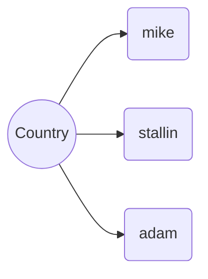

ER Diagram
-

* This is the mixture of data
*  and extraction of this data is complicated 
* so we use normalization

**First Normal Form (1NF)**
Normalization in databases is the process of organizing data in a database efficiently.

* there is 3 type of normalization
* 1nf, 2nf, 3nf
* 1nf is store the data they are not in collection of values

after 1nf is done we go with 2nf form
**Second Normal Form (2NF)**
* 2nf says now every record in your table you should locate it uniquely
* firstly group the relevent column together and keep it in one table
* find the relevent between columns and group that and segregate data into multiple tables
* in every record of the table it should be an identify uniquely, it can be id, email, mobile

after 2nf is done we go with 3nf form

**Second Normal Form (2NF)**
* remove unnecessary redencency data 

* separate all the tables based on duplicate values
* now link them together using foreign keys
* according to this we will write the hibernate code

### Mapping ###

**One to many**

**Many to many**

