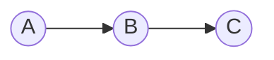
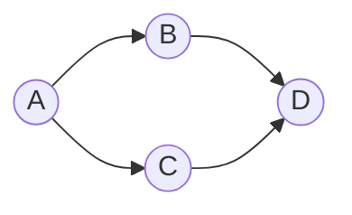
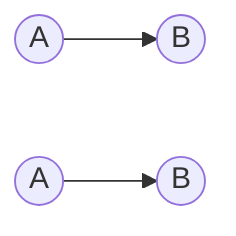

```java
package p1;
public class A {
	  int x =10;
	  public void test() {
		  System.out.println("From test");
	  }
}
```
```java
package p1;
public class B extends A{
	public static void main(String[] args) {
		B b1 = new B();
		System.out.println(b1.x);
		b1.test();
	}
}
```

### Multilevel Inheritance ###




```java
package p1;
public class A { //test1()
	  public void test1() {
		  System.out.println(1);
	  }
}
```

```java
package p1;
public class B extends A{ //test1(),test2()
	public void test2() {
		System.out.println(2);
	}
}
```

```java
package p1;
public class C extends B{ //test1(),test2(),test3() 
public void test3() {
	System.out.println(3);	
	}
	public static void main(String[] args) {
	C c1 = new C();
	c1.test1();
	c1.test2();
	c1.test3();
	}
}
```

### Note ###
* Java doesnot support multiple Inheritance at class level but supportS multiple inheritance in interfaces
* Multiple inheritance leads to diamond problem as shown in below example.



In the above diagram the members of parent class A is inherited twice to class D.

```java
package p1;
public class A { 

}
```
```java
package p1;
public class B extends A{ 
	
}
```
```java
package p1;
public class C extends A{ 

}
```



## Non sub clases vs sub clases ##

### Non sub clases ###

```java
package p1;
public class A { 
	  int x =10;
}
```
```java
package p1;
public class B{ 
	public static void main(String[] args) {
		A a1 =  new A();
		System.out.println(a1.x);
	}
}
```

### Sub clases ###

```java
package p1;
public class A { 
	  int x =10;
}
```
```java
package p1;
public class B extends A{ 
	public static void main(String[] args) {
		B b1 =  new B();
		System.out.println(b1.x);
	}
}
```

