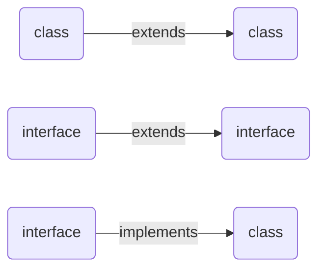
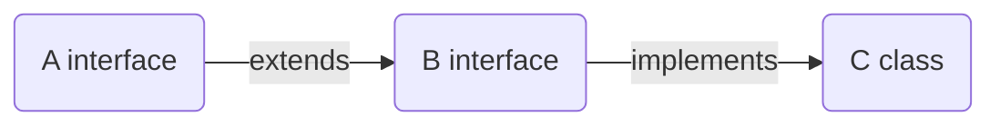

### Interfaces ###
* An  interface can consist of only incomplete methods/abstract methods in it

```java
package p1;
public interface A {
	//abstract method - incomplete methods
	public void test();
	public void example() {//Error
	}
}
```

#### inheritance from ####



* When we inherit incomplete method from an interface to class then we need to override and complete that method in class or else you will get error

```java
package p1;
public interface A {
	public void test();

}
```

```java
package p1;
public class B implements A{ //Error

}
```
------
```java
package p1;
public interface A {
	public void test();

}
```

```java
package p1;
public class B implements A{

	@Override
	public void test() {
		System.out.println("From Test");
	} 
	public static void main(String[] args) {
		B b1 = new B();
		b1.test();
	}
}
```

* When a class implements a interface then that class is getting into contract with interface to complete all inherired method.

```java
package p1;
public interface A {
	public void test1();
	public void test2();
}
```

```java
package p1;
public class B implements A {
	@Override
	public void test1() {

	}
	@Override
	public void test2() {

	}
	public static void main(String[] args) {
		B b1 = new B();
		b1.test1();
		b1.test2();
	}
}
```


```java
package p1;
public interface A {
	public void test1();
}
```

```java
package p1;
public interface B extends A {
	public void test2();
}
```

```java
package p1;
public class C implements B{
	@Override
	public void test1() {
		System.out.println(1);
	}

	@Override
	public void test2() {
		System.out.println(2);
	}
	public static void main(String[] args) {
		C c1 = new C();
		c1.test1();
		c1.test2();
	}
}
```

* Interface supports multiple inheritance in java
```java
package p1;
public interface A {
	public void test1();
}
```

```java
package p1;
public interface B{
	public void test2();
}
```

```java
package p1;
public interface C extends B,A{
	public void test3();
	
}
```

```java
package p1;

public class D implements C{
	@Override
	public void test2() {
		System.out.println(2);
	}

	@Override
	public void test1() {
		System.out.println(1);
	}

	@Override
	public void test3() {
		System.out.println(3);
	}
	public static void main(String[] args) {
		D d1 = new D();
		d1.test1();
		d1.test2();
		d1.test3();
	}
}
```
---
```java
package p1;
public interface A {
	public void test1();
}
```

```java
package p1;
public interface B{
	public void test2();
}
```
```java
package p1;
	public class C implements B,A{
	
		@Override
		public void test1() {
			System.out.println(1);
		}
	
		@Override
		public void test2() {
			System.out.println(2);
		}
		public static void main(String[] args) {
			C c1 = new C();
			c1.test1();
			c1.test2();
		}
	}
```

