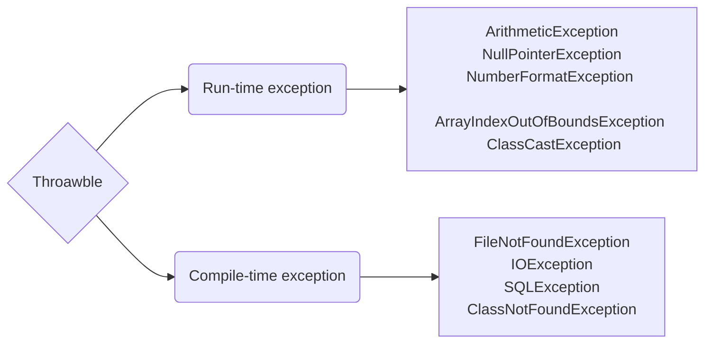

### ArithmeticException ###
* Whenever we perform invalid mathematical operation like dividing a number by zero we get the exception.
* We can handle the exception using ArithmeticException class as soon below.
* This can handle by ArithmeticException (specific exception class)

```java
public class A{
	public static void main(String[] args) {
		try {
			int x = 10;
			int y = 0;
			int z = x/y; 
			System.out.println(100);
		} catch (ArithmeticException a) {
			a.printStackTrace();
		}
		System.out.println("Welcome");
	}
}
```

### NullPointerException ###
* Whenever we access non static variable with Null reference variable we get NullPointerException as shown below
* This ca handle only NullPointerException(specific Exception class)

```java
public class A{
	int x = 100;
	public static void main(String[] args) {
		try {
			A a1 = null;
			System.out.println(a1.x);
		} catch (NullPointerException a) {
			a.printStackTrace();
		}
		System.out.println("Welcome");
	}
}
```

### Note ###

Exception class can handle any kind of Exceptions. Hence canbe considered as global exception class.

### NumberFormatException ###

```java
public class A{
	public static void main(String[] args) {
		String x = "100";
		int y = Integer.parseInt(x);
		System.out.println(y);
	}
}
```

### Wrapper class ###
* byte : Byte
* short : Short
* int : Integer
* long : Long
* float : Float
* double : Double
* char : Character
* boolean : Boolean

```java
public class A{
	public static void main(String[] args) {
		String x1 = "100";
		int y1 = Integer.parseInt(x1);
		System.out.println(y1);
		
		String x2 = "100";
		float y2 = Float.parseFloat(x2);
		System.out.println(y2);
		
		String x3 = "100";
		long y3 = Long.parseLong(x3);
		System.out.println(y3);
	}
}
```
