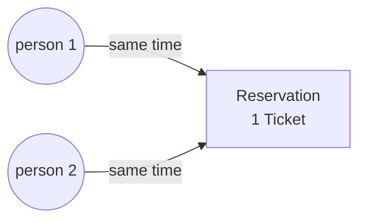

```java
public class A {
	int balance = 0;

	public static void main(String[] args) {
		A a1 = new A();
		a1.account();
		System.out.println(a1.balance);
	}

	public void account() {
		Thread t1 = new Thread(new Runnable() {
			
			@Override
			public void run() {
				add();
			}

		});

		Thread t2 = new Thread(new Runnable() {

			@Override
			public void run() {
				sub();
			}

		});
		t1.start();
		t2.start();
		try {
			t1.join();
			t2.join();
		} catch (Exception e) {
			System.out.println(e);
		}
		

	}

	public void add() {
		for (int i = 0; i < 10000; i++) {
			balance = balance + i;
		}
	}

	public void sub() {
		for (int i = 0; i < 10000; i++) {
			balance = balance - i;
		}
	}
}
```

* if threads operating in a non-synchronized manner then the data corruption happen

