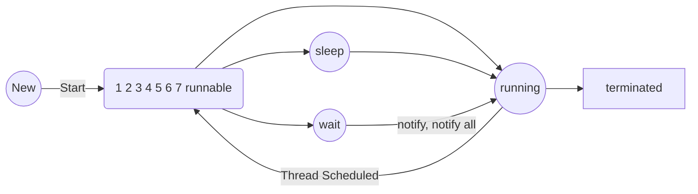

```
public class A extends Thread {
	int total = 0;

	@Override
	public synchronized void run() {
		for (int i = 0; i < 1000; i++) {
			total = total + i;
		}
		notify();
	}
}

public class B {
	public static void main(String[] args) {
		A a1 = new A();
		a1.start();

		synchronized (a1) {
			try {
				a1.wait();
			} catch (Exception e) {
				e.printStackTrace();
			}
		}

		System.out.println(a1.total);
	}
}

```