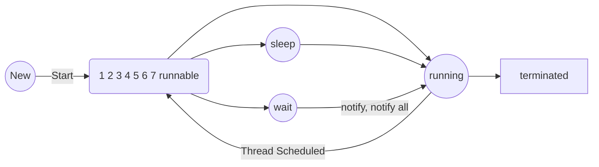

```mermaid
graph LR
A((New)) -- Start --> B(1 2 3 4 5 6 7 runnable)
B --> C((running))
C -- Thread Scheduled -->B
C --> D[terminated]
B --> E((sleep))
E --> C
B --> F((wait))
F -- notify, notify all--> C

```