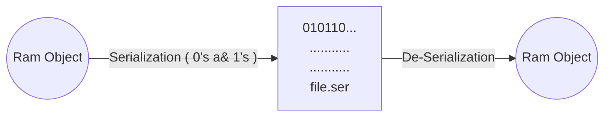

# Serialization & De-Serialization #

A a1 = new  A();



* In Serialization we converts object state to binaries and then store that into file permanently.
* In deserialization we read the binaries from the file & we form object back.

```java
import java.io.Serializable;

public class A implements Serializable{ //Maeker Interface
	public String name = "mike";
	transient public String password = "test";
}
```
* transient keyword will sikp writing content to object
```java
import java.io.FileOutputStream;
import java.io.ObjectOutputStream;

public class B {//serialization
	public static void main(String[] args) {
		try {
			FileOutputStream fos = new FileOutputStream("D://test//object.ser");
			A a1 = new A();
			ObjectOutputStream oos = new ObjectOutputStream(fos);
			
			oos.writeObject(a1);
			fos.close();
			oos.close();
			
		} catch (Exception e) {
			e.printStackTrace();
		}
	}
}

```
```java
import java.io.FileInputStream;
import java.io.ObjectInputStream;

public class C {//deserialization
	public static void main(String[] args) {
		try {
			FileInputStream fis = new FileInputStream("D://test//object.ser");
			ObjectInputStream ois = new ObjectInputStream(fis);
			
			A a1 = (A)ois.readObject();
			System.out.println(a1.name);
			System.out.println(a1.password);
		} catch (Exception e) {
			e.printStackTrace();
		}
	}
}

```
